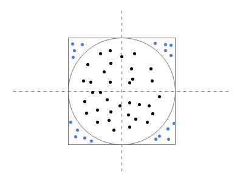

  

**规定：**  
S<sub>R</sub> 为正方形面积，S<sub>C</sub>为圆形面积，r为圆形半径。 
 
**已知：**  
S<sub>R</sub> = 4r<sup>2</sup>  
S<sub>C</sub> = πr<sup>2</sup>  

则 π = S<sub>C</sub> / S<sub>R</sub> * 4   

如果其中点数接近无穷大，则圆形内的点数可视为圆形的面积，而正方形内的面积可视为正方形的面积。  
如下代码所示，循环次数越多，则求得的π值越精确。  

```c
#include <iostream>

int main() {

    int64_t count = 100000;
    double part = 1.0 / count;
    double inside = 0;
    double x, y;

    for (int64_t i = 1; i <= count; ++i) {
        for (int64_t j = 1; j <= count; ++j) {
            x = part * i;
            y = part * j;
            if (x * x + y * y <= 1) {
                inside++;
            }
        }
    }

    double pi = inside / (count * count) * 4;

    printf("%f\n", pi);
    return 0;
}
```

   